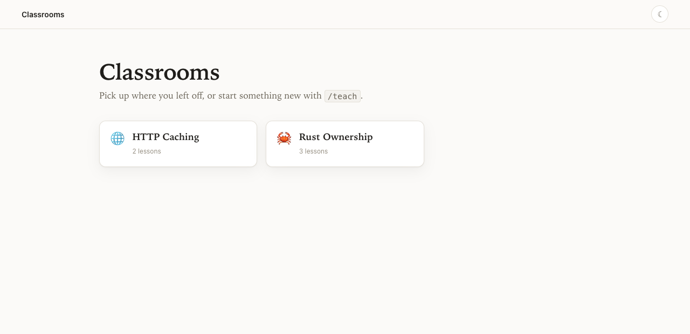
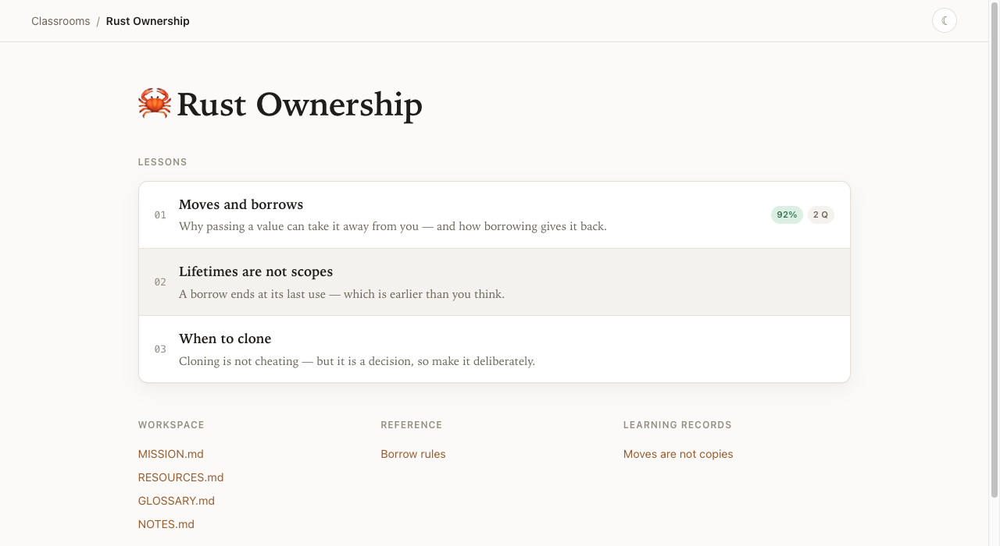
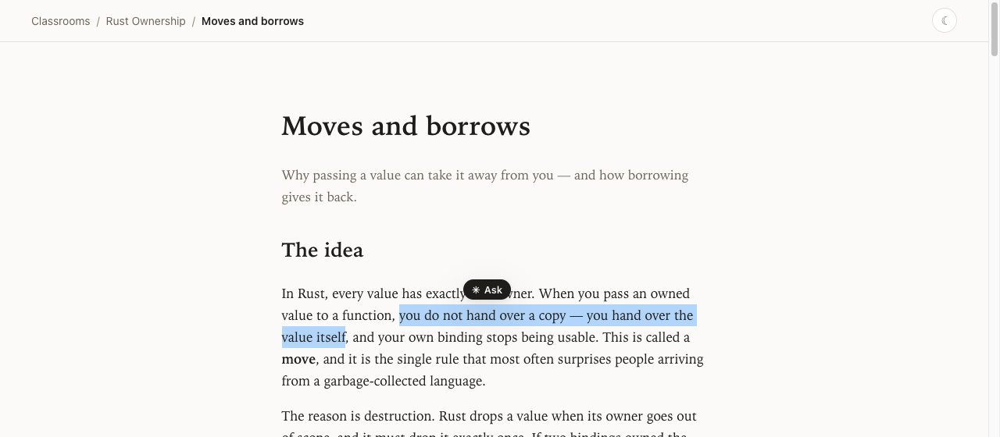
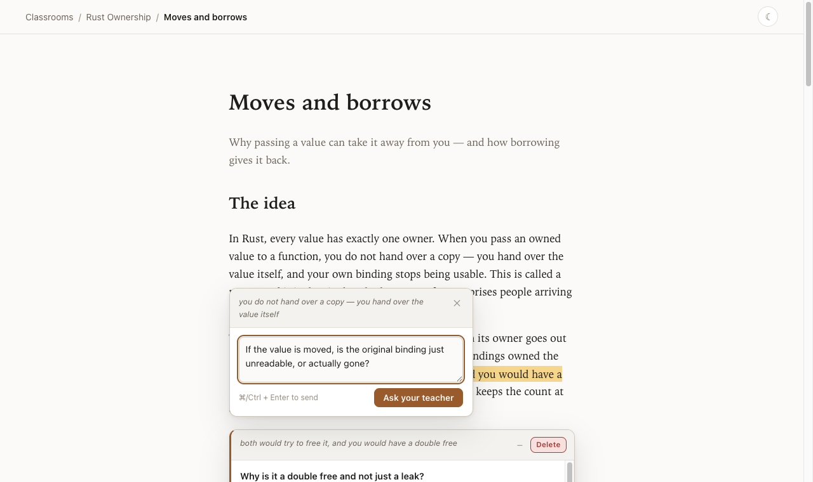
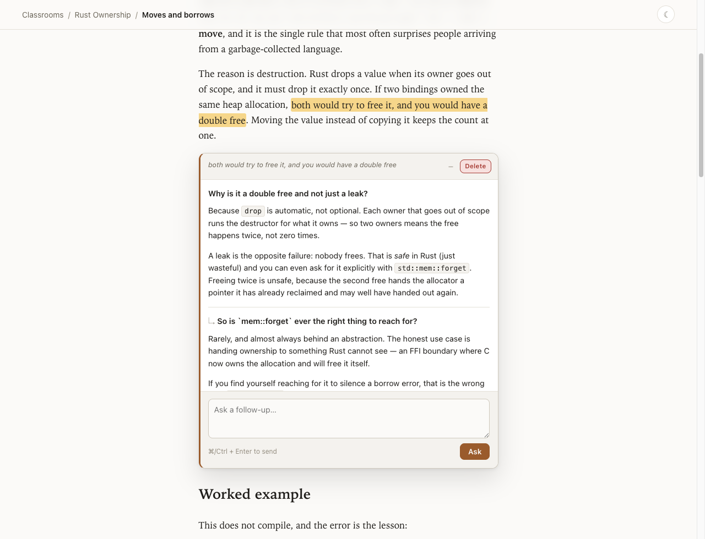
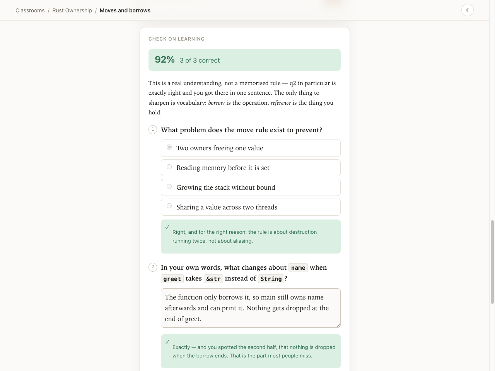
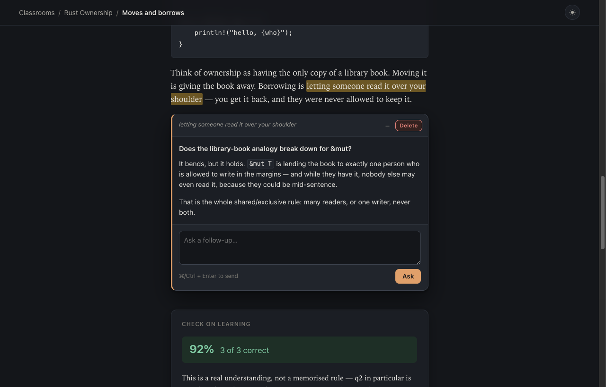

# pi-teach

A fully-featured [Pi](https://github.com/badlogic/pi-mono) extension based on Matt Pocock's `teach` skill (see `docs/ATTRIBUTION.md`).
The same repository is also a plugin for [Claude Code](#claude-code-and-codex) and
[Codex](#claude-code-and-codex).

Lessons are self-contained HTML documents stored under `~/.pi/agent/classrooms/`. A
local server presents them — a landing page of classrooms, each with its lessons,
reference material, and mission — and wires every lesson back to the agent running in
your Pi session. Highlight any sentence to ask about it and the answer appears in a card
pinned to that passage. Hand in a quiz and your teacher grades it.



## Features

- **`/classroom`** — a local web UI for everything you have learned. Clean, responsive,
  and light/dark following your system preference with a manual override.
- **Highlight to ask.** Select text in a lesson, hit _Ask_, type a question. It reaches
  the agent in your session; the answer streams back into a card anchored to the
  highlight. Minimise a card to a small badge in the margin of the text; click to reopen.
  Everything persists, so it is all still there after a reload.
- **Follow-ups in the card.** Every card has a box at the bottom for the next question.
  The teacher gets the whole thread — the passage, every question, every answer so far —
  so "why?" is a complete question. The thread stays anchored to the same highlight.
- **Quizzes that get graded.** A canonical HTML markup contract for quizzes, tests, and
  checks on learning. Submitting writes your answers to the lesson directory and asks
  your teacher to grade them; the grade renders inline, per question.
- **Nine question types for any topic.** Each question has a `data-type` for what the
  learner produces: `choice`, `multi`, `term`, `short`, `numeric`, `cloze`, `order`,
  `match`, and `locate`. A `.cl-q-stimulus` block holds what they look at: a passage,
  code, a table, or an image. A quiz that breaks the contract shows its errors on the
  page and cannot be submitted.
- **Lessons shaped by the objective.** The lesson template is a shell, not a fixed
  script. The scaffold tools return the authoring steps: read the current quiz
  contract, state the objective, choose the lesson experience and response types,
  write the questions and a private rubric, and check the page. `docs/TEACHING.md`
  lists optional lesson patterns and when to use each feature.
- **Saved quizzes and pretests.** A graded quiz stays locked. Saved attempts and
  grades are kept. Missed ideas get a new question in chat and spaced review later.
  A pretest (`data-kind="pretest"`) comes before the teaching. It never counts toward
  the score. Quiz answers do not ask for a confidence rating.
- **Spaced review.** Every graded question gets a review schedule: 1, 3, 7, 21, then 60
  days. The schedule is calculated from the grades on disk. `scaffold_review` builds a
  review lesson from the due questions, mixed across lessons. Correctness controls
  the schedule. Saved confidence metadata is kept but no longer affects review.
- **Self-explanations.** A `form.cl-reflect` asks the learner to explain an idea in
  their own words. The teacher reads it. It is never graded.
- **Glossary terms in lessons.** The first use of each `GLOSSARY.md` term in each
  section is underlined. A click asks the learner to recall the meaning before it
  shows the definition.
- **Progress and lesson health.** The classroom page shows what is due, what is
  mastered, and the glossary size. `lesson_health` tells the teacher which passages and
  questions did not land.
- **A widget that says who is teaching.** While the server is up, the TUI shows
  `📚 classroom server running on port <port>` below the editor. With several Pi sessions
  open, that is how you find the one a learner's browser is actually talking to.
- **Canonical storage.** One place for all teaching material, so lessons are not
  scattered across whatever directory you happened to be in.

## Install

### Pi

```bash
pi install git:github.com/max-miller1204/pi-teach
```

The extension registers two commands, `/teach` and `/classroom`, four tools, and a status
widget. It has one runtime dependency (`marked`) and no build step.

### Claude Code

```bash
claude plugin marketplace add max-miller1204/pi-teach
claude plugin install pi-teach@pi-teach
```

### Codex

```bash
codex plugin marketplace add max-miller1204/pi-teach
codex plugin add pi-teach@pi-teach
```

Claude Code and Codex need Node 22.18 or later on your `PATH`. The plugin runs
TypeScript directly, with no build step. On its first start it runs
`npm ci --omit=dev` in the plugin directory to install `marked`.

## What it looks like

A classroom collects its lessons in order, alongside its mission, reference sheets, and
its newest learning records — the full list, each with its summary, has a page of its
own. Lessons you have been quizzed on carry their score, and lessons you have
asked about carry a question count.



Select any text in a lesson and an _Ask_ pill appears above it.



The composer keeps the passage you highlighted attached to the question, so the teacher
answers with the context in hand.



The answer arrives as a card pinned below the block containing your highlight — never
floating over the text it explains. The card is a thread: ask a follow-up in the box at
the bottom and the teacher gets every turn so far.



Quizzes are graded in place, question by question, with an overall score and feedback at
the top. Submissions and grades live in the lesson directory, so a reload brings the whole
thing back.

After a wrong answer, the teacher explains the missed idea and asks a new question
in chat. Reply there so the teacher can check your understanding before moving on.
The same teaching rule applies in Pi, Claude Code, and Codex.



Every page follows your system theme, with a manual override that sticks — lessons,
cards, and grades included.



<sub>Screenshots use a throwaway demo classroom, not real teaching material.</sub>

## Usage

```text
/teach <topic>          start learning something new
/teach                  continue where you left off
/teach rust-ownership   continue a specific classroom

/classroom              open the classroom browser (starts the server if needed)
/classroom rust         open one classroom directly
/classroom list         list classrooms and lessons in the TUI
/classroom status       is the server running, and where
/classroom start|stop   manage the server explicitly
```

While it is running, the TUI carries a `📚 classroom server running on port <port>` widget
below the editor. It appears when the server starts, clears when it stops or the session
ends, and always reports the port in use.

The server binds to `127.0.0.1` on an ephemeral port and runs **inside your Pi session**.
That is what makes questions and grading work: a detached daemon could serve the pages,
but it could not reach your agent. It stops when the session ends — `/classroom` starts
it again, and nothing is lost, because all state is on disk.

## Claude Code and Codex

The plugin gives Claude Code and Codex the same classrooms, lessons, and web UI as Pi. It
has two skills and one MCP server, `classroom`.

```text
/pi-teach:teach <topic>     Claude Code: start or continue learning something
/pi-teach:classroom         Claude Code: open or list your classrooms
```

In Codex, ask it to teach you a topic, or mention the `teach` or `classroom` skill.

Pi keeps its server inside the live Pi session. Claude Code and Codex attach to a
persistent local service. Closing the initiating chat does not stop the service.

1. The initiating agent writes a lesson and its private rubric.
2. It calls `open_classroom`. The service records one teacher backend per classroom.
3. A browser question or submission starts work in that classroom's dedicated teacher.
4. The service validates and saves the teacher's plan. It applies answers and grades
   in the process that owns the browser's SSE connection.
5. After a missed answer, the teacher asks a new retrieval question in the lesson's
   teacher panel. Reply in that panel. The graded quiz stays locked.

The teacher does not advance lessons. Ask the initiating agent for new material after
completing the check. Learning records and spaced review keep the existing teaching
method. Historical grades remain unchanged. Skipped checks stay in notes as unresolved gaps.
A pretest can record prior knowledge demonstrated by a correct answer.

The persistent service requires Unix local sockets. The service owns one classrooms root. It binds to `127.0.0.1:43123` by default. Set
`PI_CLASSROOM_SERVICE_PORT` to an explicit port before starting it. A port conflict
stops startup. The service never selects another port. Pi's existing port setting
and lifecycle remain unchanged.

The initiating host selects the teacher backend. Set `PI_CLASSROOM_TEACHER` to
`codex` or `claude`, or pass `teacher_backend` to `open_classroom`, when the host is
unknown. An existing classroom cannot silently change backend. The service records
the dedicated session ID. Codex uses its supported app-server `thread/start`,
`thread/resume`, and `turn/start` calls. Claude uses its authenticated CLI with
`--json-schema` and `--resume`. Both return structured plans. They do not write grades
or answer files directly. The service uses the shared tool validation to apply them.

Use `classroom_service` with action start, status, or stop. You can also use:

```sh
npm run service -- start
npm run service -- status
npm run service -- stop
```

Status reports the owner process, package path, classrooms root, port, and log path.
A different package version or port must be stopped explicitly before replacement.
The service stores control state in `<classrooms root>/.pi-teach-service/`. Its control
socket permits access only to the local user. Classroom teacher state lives in
`.teacher.json`, which is never a static route. The service saves each request and
plan before applying writes. It skips grades already saved for that submission.
An interrupted model call becomes a visible error. Use Retry request in the teacher
panel to run it again. Saved plans finish without another model call. Model calls
have a 180-second limit. Model and authentication errors remain visible.

For phone access, ask the agent to call `classroom_phone` with action start,
classroom, and lesson. The helper uses the existing Tailscale installation and node.
It creates a tailnet-only HTTPS Serve route on explicit port 8443 by default. It
checks the complete URL before returning it. Use `https_port` to select a free port
explicitly if that port is occupied. The helper rejects conflicts and Funnel-enabled
ports. It preserves unrelated Serve routes. Use its status and stop actions to
inspect and remove the owned route. Service stop removes that route first.
This does not enable public access. Tailnet members allowed by your Tailscale policy
can reach the classroom pages and submit requests.

The adapters follow the official [Codex app-server documentation](https://learn.chatgpt.com/docs/app-server),
[Claude CLI documentation](https://code.claude.com/docs/en/headless), and
[Tailscale Serve documentation](https://tailscale.com/docs/reference/tailscale-cli/serve).

## Storage

```text
~/.pi/agent/classrooms/
  <classroom-name>/
    classroom.json          title and emoji
    MISSION.md              why you are learning this
    RESOURCES.md            trusted sources, split Knowledge / Wisdom
    GLOSSARY.md             canonical terminology
    NOTES.md                your preferences, and an index of the teacher's notes
    notes/                  slug.md — the topic files NOTES.md indexes
    quiz/retrieval-checks/  successful chat checks linked to review items
    learning-records/       NNNN-slug.md — what you have actually learned
    reference/*.html        cheat sheets, built to be revisited and printed
    assets/                 shared components across lessons
    NNN-lesson-name/
      lesson.html           the lesson
      lesson.json           title and summary
      annotations.json      your question threads and their answers
      reflections.json      your self-explanations
      quiz/
        submissions/*.json  your answers
        grades/*.json       your teacher's grading
```

Set `PI_CLASSROOMS_DIR` to keep material somewhere else. Pi, Claude Code, and Codex all
use the same directory, so a classroom you start in one continues in the others.

A lesson directory is recognised by containing an HTML document: `lesson.html` if
present, else the first `lesson-*.html` (so a literal `lesson-001.html` works), else the
first `.html` file. Lesson order comes from the numeric prefix on the directory name.

The `quiz/` directory is never served as static files, only through the JSON API. An
answer key written to `quiz/key.json` is therefore not readable from the page.

### Links in teaching documents

Links to other sites, and PDFs wherever they are hosted, open in a new tab — in
lessons, reference documents, and the classroom's markdown pages. Classroom and lesson
navigation stay in the current tab. Links that set their own `target`, or carry a
`download` attribute, are left alone.

Lesson URLs use `/c/<classroom>/<lesson>` without a trailing slash. They do not match
filesystem paths. From a lesson, use:

- `./` for the classroom page.
- `assets/<path>` for shared classroom assets.
- `<other-lesson>` for another lesson in the same classroom.
- `/r/<classroom>/<file>.html` for a reference document.

Do not use `../assets/<path>` from a lesson. It resolves to `/c/assets/<path>`.
From a reference document, use `/c/<classroom>/<lesson>` for lesson links. Replace
`{{CLASSROOM_NAME}}` in the reference template with the classroom directory name.

## Configuration

Optional, at `~/.pi/agent/classroom.json`:

```json
{
  "port": 4098,
  "autoOpen": true
}
```

| Key        | Default   | Meaning                                                                        |
| ---------- | --------- | ------------------------------------------------------------------------------ |
| `port`     | ephemeral | Fixed port. An occupied or invalid port causes an error.                       |
| `autoOpen` | `true`    | Whether `/classroom` opens your browser. `PI_CLASSROOM_AUTO_OPEN=0` overrides. |

Claude Code and Codex read the same file. `open_classroom` returns a link by default.
Set `open_browser: true` only for a requested browser launch. `autoOpen: false` or
`PI_CLASSROOM_AUTO_OPEN=0` also disables that explicit launch. Starting or continuing
a lesson does not open a visible browser. Lesson checks run in a separate headless
session. The scaffold instructions name the packaged headless config.
Set `PI_CLASSROOM_CONFIG` to read the settings from another file.

Use a configured fixed port to keep URLs stable across session restarts. Only one
session can use that port at a time. With no port configured, each session uses an
ephemeral port. Get the current URL from `open_classroom` or `/classroom`.

## Tools

\*used by the agent

| Tool                     | Purpose                                                                                                      |
| ------------------------ | ------------------------------------------------------------------------------------------------------------ |
| `answer_lesson_question` | Answer a highlighted-text question or a follow-up. The only thing that puts an answer on the learner's page. |
| `grade_lesson_quiz`      | Grade a submitted quiz. Writes to `quiz/grades/` and renders inline.                                         |
| `scaffold_classroom`     | Create a classroom in the canonical location with a `MISSION.md` stub.                                       |
| `scaffold_lesson`        | Create a numbered lesson shell, and return the authoring steps.                                              |
| `scaffold_review`        | Create a spaced review lesson from the due questions, and return them with their keys and authoring steps.   |
| `record_retrieval_check` | Link successful chat evidence to a review item without changing scores.                                      |
| `lesson_health`          | Report threads, misses, glossary problems, unfinished questions, missing rubrics, and recent response types. |

Grades support per-question points. Partial credit appears separately from fully
correct answers. Health distinguishes incomplete answers and resolved gaps.
Historical grades stay unchanged. Historical grades without points cannot show
how partial credit was distributed.

The Claude Code and Codex plugin exposes authoring tools and these service tools.
The dedicated teacher owns answer, grade, and retrieval writes:

| Tool                | Purpose                                                                        |
| ------------------- | ------------------------------------------------------------------------------ |
| `begin_teaching`    | Return the teaching method and the learner's classroom. Replaces `/teach`.     |
| `open_classroom`    | Start the server, open the browser, and return the URL. Replaces `/classroom`. |
| `list_classrooms`   | List classrooms and lessons with scores. Replaces `/classroom list`.           |
| `classroom_service` | Start, inspect, or explicitly stop the service.                                |
| `classroom_phone`   | Start, inspect, or stop the owned phone route.                                 |

## Limitations and gotchas

- **Pi is session-scoped.** Close the Pi session and its pages stop serving.
  Claude Code and Codex use the persistent service. Stop it explicitly.
- **The widget needs a UI.** In non-interactive modes there is nowhere to draw it, so it
  is silently skipped; `/classroom status` still reports the server.
- **Asking requires a live session.** Highlight-to-ask and grading go to the agent in the
  Pi session that started the server. With no session, lessons are still readable but
  nothing answers.
- **Highlights can orphan.** Anchoring uses a text-quote selector, so a highlight
  survives reflow and edits around it. If the teacher rewrites the exact sentence you
  highlighted, the card survives but arrives minimised and unanchored rather than
  pointing at the wrong text.
- **Follow-ups wait for the first answer.** The box appears once the card's original
  question has been answered — a thread with nothing in it has no context to build on.
- **One question at a time per card.** `answer_lesson_question` takes only an annotation
  id and attaches the answer to the oldest turn still waiting, so firing several
  follow-ups before any is answered is fine, but answers land in the order asked.
- **One quiz form per `data-quiz-id`.** Reusing an id within a lesson means the second
  form rehydrates from the first one's submission.
- **Never renumber `data-question-id`** after a learner has submitted — grades are
  matched back to questions by that id.
- **Teacher failures require a retry.** The teacher panel shows the specific error.
  Saved requests stay on disk. Click Retry request after resolving the cause.
- **Loopback only.** The HTTP service binds to `127.0.0.1`. Phone access uses an
  opt-in Tailscale Serve route. It does not use Funnel.

## Development

```bash
npm ci
npm run check       # tsc --noEmit
npm test            # vitest
pi -e .             # run this checkout in a Pi session without installing it
claude --plugin-dir .   # run this checkout as a Claude Code plugin
claude plugin validate .
npm run e2e:claude      # a real Claude Code session: answer a question, grade a quiz
npm run e2e:codex       # the same, through Codex
npm run e2e:browser     # browser state tests with the real server
npm run e2e:pi          # a real Pi session: question, quiz, and chat follow-up
npm run e2e:authoring -- claude   # a real agent writes lessons; the script submits them
npm run e2e:authoring -- codex
```

`e2e:authoring` gives the agent learning objectives only. The agent writes the
lessons from the scaffold. The script inspects them, submits every quiz in the
browser, lets a second session grade them, and checks the page after a reload. It
prints a report of each lesson's outline, quiz kinds, and response types. Model
output varies between runs. Read the report as an evaluation, not as proof.

All e2e scripts use the installed `playwright-cli` to drive the lesson page.
The Pi, Claude Code, and Codex tests call a real model. They need a logged-in harness and
are not part of CI. The browser state test uses the grading tool without a model.
They use a temporary classrooms directory. The Codex run also uses a temporary
`CODEX_HOME` that holds a copy of your `auth.json`. The script deletes both when it ends.

To save screenshots, pass an output directory to an E2E test:

```bash
npm run e2e:browser -- /tmp/pi-teach-evidence
npm run e2e:pi -- /tmp/pi-teach-evidence
npm run e2e:claude -- /tmp/pi-teach-evidence
npm run e2e:codex -- /tmp/pi-teach-evidence
```

The package is installed from git, not npm: `pi install git:github.com/max-miller1204/pi-teach`
clones the repository and runs `npm install`, so whatever is on `main` is what you get.

Browser code under `assets/runtime/` is `.mjs`/`.js` with hand-written `.d.mts` sidecars
where TypeScript needs types — this repo has no build step, and the browser has to load
these files directly. `anchor.mjs` is imported by both the browser and the test suite, so
the anchoring logic is tested against the same code that runs.

## License

MIT — see `LICENSE`. The teaching methodology under `docs/` is derived from the `teach`
skill by [Matt Pocock](https://github.com/mattpocock/skills).
